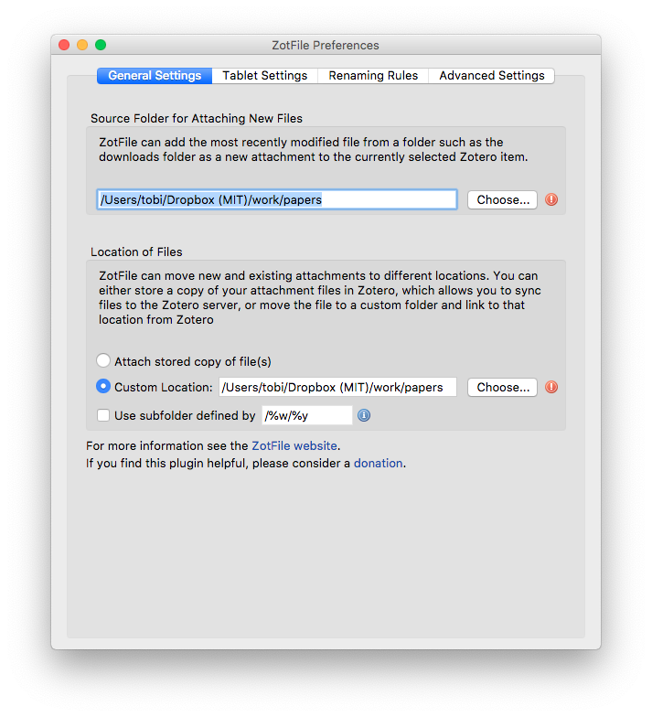
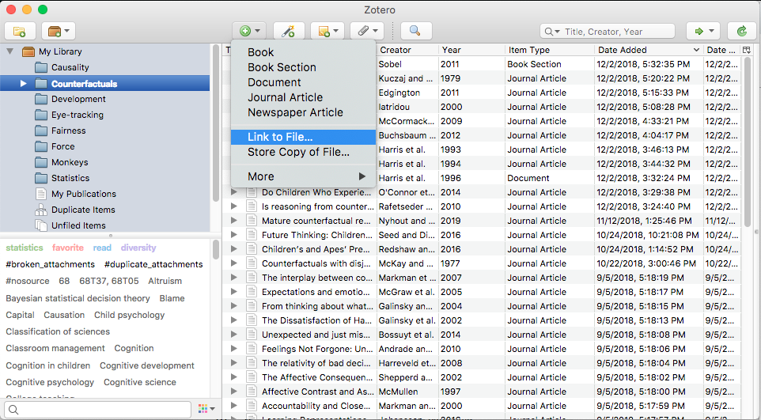
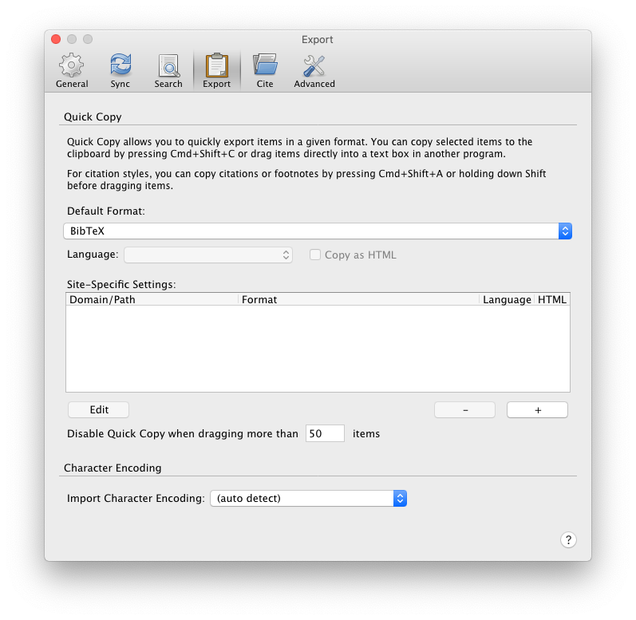
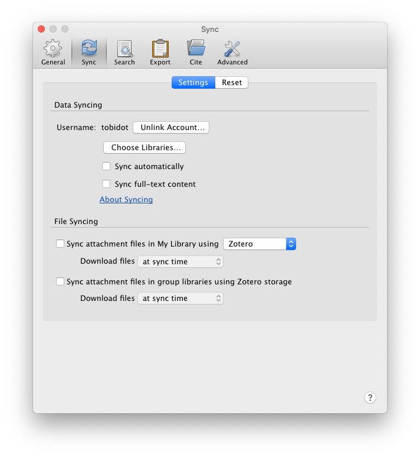

Zotero is a handy tool you can use to organize your personal library of papers. It's free, open-source, and critically scalable to large libraries of papers. On top of that, you can add on lots of nice features for things like paper auto-naming, and linking with bibdesk. Highly recommended for lab members! Here are some quick highlights for installation and feature setup.

## Installation

Zotero can be downloaded for free [here](https://www.zotero.org/download/). It's available on Mac, Windows, and Linux, as well as through a chrome connector if you prefer to use it through the browser.

## Add-ons

A couple helpful add-ons to install with Zotero:

- [ZotFile](http://zotfile.com/) -- Automatically extracts meta-data from your papers. Labels papers with information like paper title, author, publication, year, etc.
- [Zutilo](https://github.com/willsALMANJ/Zutilo) -- Allows you to customize keyboard shortcuts for Zotero.
- [QuickLook](https://github.com/mronkko/ZoteroQuickLook/releases) -- Nice shortcut to allow you to view the paper without opening it.
- [scite](https://github.com/scitedotai/scite-zotero-plugin) -- Plugin to see how many times paper were mentioned, supported, and disputed. 

## Setup

1. Have a local `papers` folder on your computer. You might want to have this folder within dropbox so that your papers are synced. The structure of that folder should be flat, as in just throw all your papers in together with no sub folders. Zotero takes care of any structure that you might want to add. If you already have a folder, create a backup before integrating with zotero (e.g. just copy your papers folder and call it `papers-backup`). 

2. After having installed the [ZotFile](http://zotfile.com/) add-on, link zotero to your local folder like so: 

3. Link your papers to zotero (they will be renamed automatically), like so: 

Whenever you download new papers into your local `papers` folder, repeat step 3. and add these papers. 

Once you have setup that works, don't play with the paper names in your local folder directly. It will mess up Zotero's pointers to those documents.

__Important__: Don't drag and drop pdfs into Zotero. If you do so, they will be added to the library but Zotero uses its own internal way of managing the references that way which means it creates new folders and renames the pdf giving it some cryptic file name. Instead, always use the `Link to File ...` route in order to add new papers. 

## Recursive collections 

By default, items added to a subcollection do not automatically appear in the parent collection(s). This can be changed by setting the "recursiveCollections" hidden preference to 'true'. Click "Config Editor" in the Advanced pane of Zotero preferences and type "recursive" (without quotes) into the search box. Double-click on "extensions.zotero.recursiveCollections" to toggle it between 'true' and 'false'. The change will take effect the next time you select a collection, but it will not apply automatically to Zotero running on other computers. More info [here](https://www.zotero.org/support/collections_and_tags).

## Bibtex integration 

If you use LaTeX (which you should :P), you can have Zotero automatically create bibtex entries with this add-on [here](https://github.com/retorquere/zotero-better-bibtex). 

## Drag and drop references from Zotero to Bibdesk

If you use [Bibdesk](https://bibdesk.sourceforge.io/) for organizing your bibliography file you can use drag and drop to add new entries. Change the setting in Zotero link shown here: 

And then you can just drag an entry from zotero and drop it into Bibdesk. 

## Bibtex integration 

If you use LaTeX (which you should :P), you can have Zotero automatically create bibtex entries with this add-on [here](https://github.com/retorquere/zotero-better-bibtex).)

## Syncing across multiple devices 

If you use multiple devices, you can sync your library via dropbox. You need to make an account on zotero to do so but it's free. There is no need to pay for storage as you'll be using dropbox to sync your papers, and use zotero to sync the metafiles (information about your database) which is free. 

Make sure to set the sync settings like so: 

